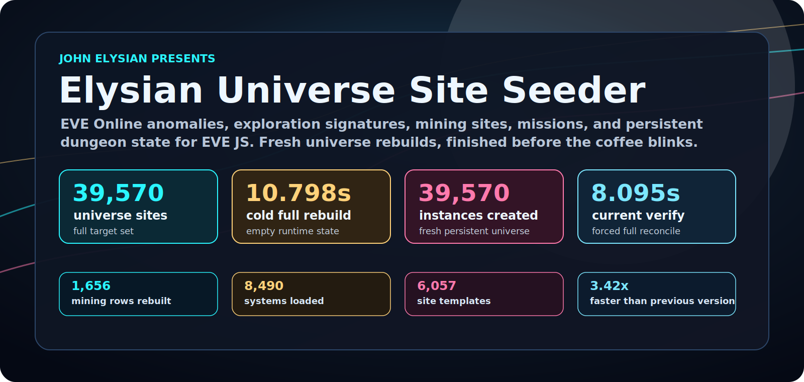
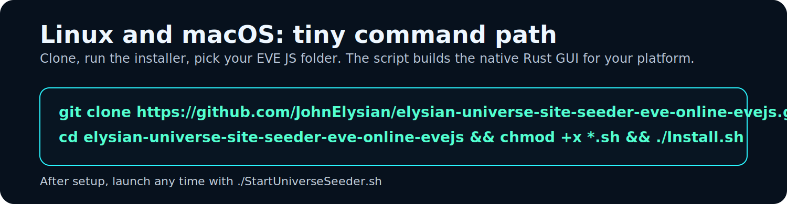
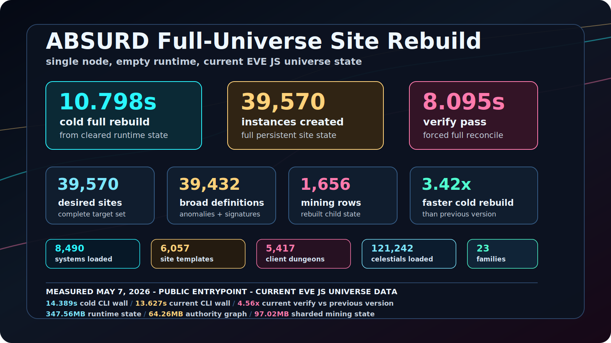
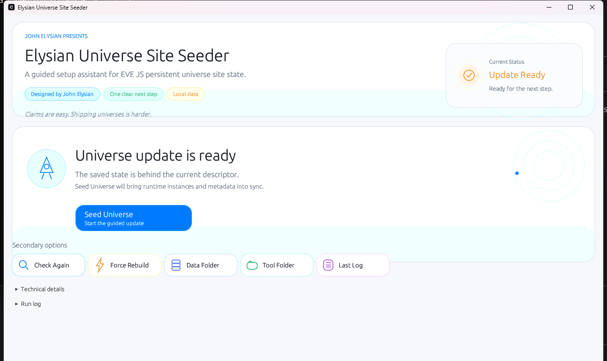
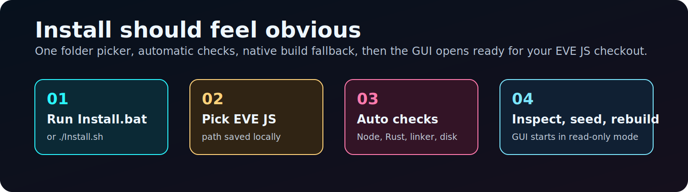
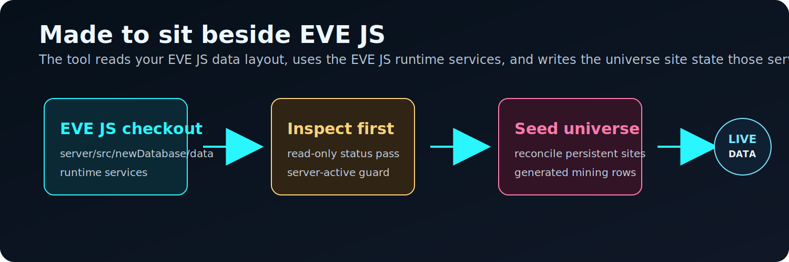
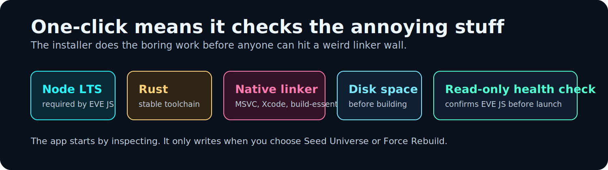

<p align="center">
  
</p>

<h1 align="center">Elysian Universe Site Seeder</h1>

<p align="center">
  <strong>EVE Online Universe Site Seeder for EVE JS</strong>
</p>

<p align="center">
  <a href="https://github.com/JohnElysian/elysian-universe-site-seeder-eve-online-evejs/actions/workflows/ci.yml"></a>
  <a href="https://github.com/JohnElysian/elysian-universe-site-seeder-eve-online-evejs/releases/latest"></a>
  
  
</p>

<p align="center">
  <a href="#download--install"><strong>Download</strong></a>
  |
  <a href="#linux--macos-fast-path"><strong>Linux/macOS</strong></a>
  |
  <a href="#full-universe-scale"><strong>Scale</strong></a>
  |
  <a href="#the-app"><strong>Screenshot</strong></a>
  |
  <a href="#built-for-eve-js"><strong>EVE JS</strong></a>
</p>

<p align="center">
  <strong>One native GUI. One EVE JS folder. Full persistent universe site state.</strong>
</p>

<p align="center">
  A fast Rust desktop seeder for EVE JS persistent universe sites: anomalies,
  exploration families, generated mining sites, drifter sites, and
  mission-sourced dungeon authority.
</p>

<table>
  <tr>
    <td align="center"><strong>39,570</strong><br>desired universe sites</td>
    <td align="center"><strong>0.337s</strong><br>standalone engine</td>
    <td align="center"><strong>39,570</strong><br>instances created</td>
    <td align="center"><strong>1,656</strong><br>mining rows rebuilt</td>
  </tr>
  <tr>
    <td align="center"><strong>0.465s</strong><br>current-state engine</td>
    <td align="center"><strong>8,490</strong><br>systems loaded</td>
    <td align="center"><strong>6,040</strong><br>authority templates</td>
    <td align="center"><strong>52.79x</strong><br>faster cold rebuild</td>
  </tr>
</table>

Elysian Universe Site Seeder is open source under `AGPL-3.0-or-later`.

## Download & Install

Windows users should download the latest release:

```text
https://github.com/JohnElysian/elysian-universe-site-seeder-eve-online-evejs/releases/latest
```

Extract `Elysian-Universe-Site-Seeder.zip`, then double-click `Install.bat`.

The installer asks for your EVE JS folder, checks Node.js, Rust, native linker
tools, disk space, and the EVE JS universe-site files it needs. It then runs a
read-only health check and opens the app.

After setup, use `StartUniverseSeeder.bat`.

## Linux & macOS Fast Path

<p align="center">
  
</p>

Linux and macOS users should build the native Rust GUI from the source checkout:

```bash
git clone https://github.com/JohnElysian/elysian-universe-site-seeder-eve-online-evejs.git
cd elysian-universe-site-seeder-eve-online-evejs
chmod +x *.sh && ./Install.sh
```

Paste your EVE JS folder when asked. After setup:

```bash
./StartUniverseSeeder.sh
```

The installer tells you if the platform needs build tools such as Xcode command
line tools on macOS or build-essential/pkg-config packages on Linux.

## Full Universe Scale

<p align="center">
  
</p>

This is built for the big EVE JS universe state, not a toy demo. The benchmark
below measures the bundled standalone writer through the public Node entrypoint:
it starts from an empty runtime, builds every persistent universe site, writes
the generated mining child-state rows, and finishes in a fraction of a second
of seeder-engine time on a single node.

| Dataset / operation | Result |
| --- | ---: |
| Cold full rebuild, empty runtime state, engine time | 0.337s |
| Cold full rebuild, full Node CLI wall time | 1.271s |
| Current-state force verify / reconcile, engine time | 0.465s |
| Current-state force verify / reconcile, full Node CLI wall time | 2.489s |
| Upstream public EVE JS stored seed receipt | 17.791s |
| Speed-up vs upstream public receipt | 52.79x cold rebuild / 38.26x current verify |
| Desired persistent universe sites | 39,570 |
| Instances created during cold rebuild | 39,570 |
| Mining child-state rows rebuilt | 1,656 |
| Current-state instances retained | 39,570 |
| Broad persistent definitions | 39,432 |
| Generated mining definitions | 138 |
| EVE systems loaded by runtime | 8,490 |
| Stations loaded by runtime | 5,207 |
| Celestials loaded by runtime | 121,242 |
| Asteroid belts loaded by runtime | 40,928 |
| Stargates loaded by runtime | 13,970 |
| Universe spawn families | 23 |
| Site templates in authority graph | 6,040 |
| Client dungeon records | 5,417 |
| Mission records in authority data | 2,879 |
| Local dungeon runtime state | 347.56MB |
| Local dungeon authority graph | 64.26MB |
| Local sharded mining state | 97.02MB |

Numbers are from full public-entrypoint benchmarks on May 7, 2026 against a
clean clone of `evejs-emu/eve.js` at `3f6257d`, using
`--force-reseed-universe --force-live --batch-size 192`. The cold rebuild
benchmark cleared the dungeon runtime and generated mining runtime first.
Desktop runs include GUI/process overhead, and source checkouts automatically
refresh the local binary when the bundled seeder engine changes.

## The App

<p align="center">
  
</p>

The app opens in inspect mode. It shows whether the universe site state is
current, gives one clear next step, and keeps the write actions explicit.

## Install Should Be Boring

<p align="center">
  
</p>

| Step | What happens |
| --- | --- |
| `1` Run installer | Double-click `Install.bat` or run `./Install.sh`. |
| `2` Pick EVE JS | Choose the EVE JS checkout that contains `server/src/newDatabase/data`. |
| `3` Let checks run | Node.js, Rust, native linker tools, disk space, and EVE JS files are checked. |
| `4` Open the app | The seeder runs a read-only health check, then launches the GUI. |

## Built For EVE JS

<p align="center">
  
</p>

Elysian Universe Site Seeder is intended to work with the public EVE JS project.
It uses the EVE JS data layout and runtime services, then writes the persistent
site state that EVE JS expects.

It does not need the game server running. In fact, the seeder checks for an
active server and asks you to stop it before writing.

## What The Installer Checks

<p align="center">
  
</p>

The app only writes when you press `Seed Universe` or `Force Rebuild`. Opening
the app and running `Check Again` are read-only.

## Source Builds

The repo includes the Rust GUI source and the bundled seeder engine. Normal
Windows users should use the release zip. Developers and Linux/macOS users can
build from source with:

```bash
cargo build --release --locked
```

## License

`AGPL-3.0-or-later`

This project is not affiliated with, endorsed by, or sponsored by CCP Games.
EVE Online and related names are trademarks or registered trademarks of CCP hf.
